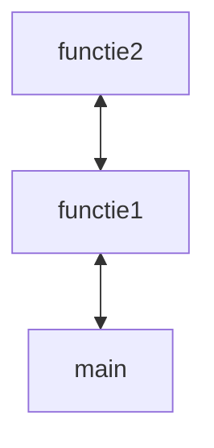

# les 1 introductie

yves@vindevogel.net
+32 497 57 08 96

vindevoy sidviny
syntra-vindevoy

github - gitlab

## pycharm
pycharm 
get from vcs

## git
### gitflow
main : productie
+ develop : wat voor programmeur ok is
	+ feature:
	+ bugfix: niet dringend
+ hotfix: 
	+ aanpassing rechtstreeks op main
	+ dringend
### Github
check out ... code van iemand anders

groen = nog niet gecommit
bruin = file in gitignore
blauw = wijziging
rood = verwijderd

commitmessage

AI assistent knopje voor commitmessage, vingerafdruk

changes -0-

altijd commit en push

bug > commit
bug > commit

checkout = bekijken (niet weggaan uit branch)

## Versiebeheer
miniconda (wordt niet gebruikt)

miniforge installeren
* commando conda
* geen licentiekosten

alles via conda

miniforge prompt (aanpassing van de command prompt)

conda-forge.org/miniforge


conda create --name syntra
conda activate syntra
conda install -c conda-forge  python pytest 
+ (-c voor channel)
+ zoekt alle onderlinge compatibele dependencies tussen de paketten

jetbrains downloaden, start trial
minipython
github login maken

# les 2
## pycharm activeren
linux terminal fish?

github.com
+ repo zoeken
+ code
+ url kopieren

pycharm
+ nieuw project
+ get from vcs (maakt nieuw project aan)

conda activeren
``` powershell
conda create --name syntra
conda activate syntra
conda install python pytest
conda
```

rechts onder add new interpreter
conda environment > zoeken naar condabin/conda.bat
syntra 


.gitignore

```.gitignore
.idea/
.vscode/
__pycache__/
```

google > think python 3d edition, green tea press
Allen B.Downey
read the online version

notebooks ctrl+enter

jupyter notebook ipynb

python wordt geinterpreteerd, niet gecompileerd (1/0)


syntax 
```python
print("hello world")

```

## ipynb
ctrl+enter = uitvoeren 

## pep regels

integers, float
```
type(30)
```

## diverse
ter info static link maken
``` bash
ln -sf python python3 #uitproberen
```

paketten bekijken
```powershell
conda env list
```

terminal activeren
```powershell
conda init fish
```

poetry : concurrent van conda

## binair getal

## arethmic functions

round(42.5) --> 42
round(43.5) --> 44
dichtst bijzijnde even getal??? uitzoeken

abs absolute waarde
strings vermenigvuldigen
float(123)
int(456
str(123)

## operatoren
NOR not(or(...))
NAND not(and(...))
XOR : "exclusive or" als er maar één en slechts één
5 ^ 2 =  

# les 3

```python
isinstance(me,str) #checken of variabele van type str is


class A:  
    pass  
a = A()  
print(isinstance(a, A))


```

tuple : sorteren
1,61km voor mile
state diagrams, overslaan

keywords, niet gebruiken

```python
import math
print(math.pi)

```


vega-altair
```bash
conda install -c conda-forge altair-all
conda install altair-all #conda forge hoeft niet
```
installeren met syntra-omgeving actief

stoppen met print, logger gebruiken
fstring "formatted string"
comments
sql standard query language
oef1_hoofdst....py

```python
import math
math.pi
math.sqrt(25)
math.pow(5,2)

int('101',2) binair
int('101',10) decimaal

import math
round(math.pi,3)


```


## comments

## errors

syntax error,
+ code wordt niet gerund
runtime error
+ starts running, gives error
semantic error

```python
%xmode Verbose

import math
radius = 5
sphere_volume = 4/3 * m

x = 42
math.cos(x)**2 + math.sin(x)**2 == 1

math.e**2

math.pow(math.e,2)
math.exp(2)

```


# les 4

## Diverse

### env-file
rechts bovenaan "current file"
configuration files, rechts boven

application file:

uvicorn options
--reload --workers=1

apparte file met settings voor dev test en productie maken
"als ik in die omgeving zit, dan ...", via env file
overdraagbaarheid tussen omgevingen

### shiny
shiny for python
### logger
self.logger.trace
info warning error fatal
### oefeningen hoofdstuk 2
```python
x = 5  
result = math.cos(5) ** 2 + math.sin(5) ** 2  
deviation = abs(result - 1)  
print(deviation < 0.000001)  
print(deviation < 10 ** -6)
```


# les 5
### oefening ivm boeken

## Versienummers
+ x version
	+ breaking change
	+ oude code gaat niet meer werken
+ y change / feature
	+ oude code blijft werken
+ z bugfix
	+ geen echte wijziging, maar oplossing van probleem

## Functions
bankrekening 
% 97
hoogste priemgetal lager dan 100

### Parameters
parameter is de naam
argument is de waarde van de parameter

### forloops
stack



stack overflow, maximum 1024 stacks

oefening 3.14 zelf uitproberen

# les 6

```python
len('text')

```


functions and methods verschil:
+ method is een functie die toegevoegd is op de klasse/object
+ method die uitgevoerd wordt op self
+ strip / lstrip / rstrip

```python
print('some text',end:'/n')
#zelfde als standaard print
```

```python
print('some text',end="")
#gaat niet naar volgende lijn
```

```python
def do_twice(f)
	f()
	f()
#functie als parameter
#doorgegeven functie wordt twee maal doorgegeven
```

recursieve functie:
+ roept zichzelf op
+ stopt

_ underscore-variabele mag als de variabele niet meer gebruikt wordt


geneste functies zijn private
underscore functies zijn bedoeld om niet te gebruiken, maar niet echt 'hidden'

double underscore is private

computerphile Hanoi towers
Recursion super power in python

# Les 7

```python
from turtle import Turtle  
from time import sleep  
  
bob = Turtle()  
bobbette = Turtle()  
  
for _ in range(4):  
    bob.forward(100)  
    bob.left(90)  
  
sleep(60)
```


```python
from turtle import Turtle  
from time import sleep  
  
bob = Turtle()  
  
  
def polygon(size, corners):  
    for i in range(corners):  
        bob.forward(size)  
        bob.right(360 / corners)  
  
  
def square(size):  
    polygon(size, 4)  
  
  
def triangle(size):  
    polygon(size, 3)  
  
  
def pentagon(size):  
    polygon(size, 5)  
  
  
def circle(size):  
    polygon(size, 360)  

def circle_by_circumference(circumference):  
    size = circumference / 360  
    polygon(size, 360)


  
  
sleep(60)
```


```python
from IPython.display import display, Markdown  
  
  
def print_markdown(text):  
    display(Markdown(text))  
  
  
print_markdown("# test")  
print_markdown("## test2")
```

stackoverflow gebeurt enkel bij functies

een parameter named, alle andere named
zolang er geen benoeming is, is is het een positionele toewijzing.
alle optionele parameters achteraan

```
def polygon(*,param_1,param_2)
# can only be used as named
```

types
+ callable
+ any

hinting geeft enkel gele errors op code
sphinx doc rst-files


conda activate syntra
consa install conda -c conda-forge numpy pandas

```python
start = datetime.now()
#code
end = datetime.now()
print(end-start)
```

!!! oplossingen van faculty ophalen uit branch van yves

docstring enkel voor documenteren

```python
#docstring
"""
this is the description of the function
param n
	int: the number on which we calculate the faculty
return
	int: the calculated faculty
raises
	valueerror...
examples
	lkjmj
Notes (wordt ook vaak onderaan gezet)
	Date: 2024-10-10
	Author: ...
	Version: 1.0.0
	bugfixomschrijving

	Date: 2024-10-10
	Author: ...
	Version: 1.0.0
	bugfixomschrijving

"""
```
pycharm gebruikt rst-taal


fruitfull functions = functions met return values (return values hoofdstuk)

```python
print(lst.sort()) #geeft niets gezien geen return
lst = lst.sort() #lijst wordt gewist
lst.sort() # sorteer de lijst lst
lst = sorted(lst) #werkt wel

```


```python
yves = {"naam":"yves","familienaam":"blabla"}
persons=[yves,chiel,tom]
persons.sort(key=lambda x: x["naam"].count("*"),reverse=True) #count of contains
```


def is_leap_year()
2024
2020
2025
2000 wel deelbaar door 400
1900 geen schrikeljaar


1 januari 1970 (unix nulpunt)

maximum int 32000 en ...
forcing keyword arguments def functie(\*,...)

reduce to single parameter


proefexamen


# 7 iteration and search

file_object.readline()

```python
print("e" in text)
#returns true

if result.upper() == "Y"

name.lower() #verandert de inhoud van de variabele niet

name = name.lower()
# verandert de inhoud van de variabele wel

# cfr sort en sorted

```

```python

while <boolean>:
	#code
	
```

while true

return stopt functie
break stopt lus
continue stopt iteratie

discrete wiskunde

recursieoefening: 
zo weinig mogelijk briefjes en munten.
+ greedy method?
+ greedy klopt niet altijd, andere methode met recursie

eval('expression_in_string'), nooit gebruiken
idem voor exec

```python
def for_with_string(text: str):  
    for i in text:  
        print(i, end=" ")  
    print()  # finishing on new line  
  
  
def name_lower(text: str):  
    text.lower()
```

is a prime?


## Newton square root


y = (x+a/x)/2
+ a = getal waarvan je wortel zoekt
+ x = gok van de uitkomst
+ y = uitkomst

```python
while True:
	print(x)
	y = (x + a/x) / 2
		if y == x:
			break
	x = y
```


## cartalk puzzlers
+ oefening 1 (versie 2)
+ priemgetal
+ som van alle nummers van 1 tot N
+ the farmers stone, steen weegt 40 kilo
+ breekt in 4 stukken 1kg 3kg 9kg 27kg
+ 1 11 21 1211 111221 312211, reeks van...?
+ 4 mannetjes
	+ max 2 tegelijk
	+ lantaarn moet altijd mee de brug over
	+ snelheid
		+ 1 mannetje 
			+ 10
			+ 5
			+ 2
			+ 1
		+ wat is snelste manier om over te geraken?

``de zeef van erastostenes


## les dd 05/11/24 : github
sourcetree (windows, niet voor linux)
github, gitlab, azure devops(bedrijf)
gitlab:
+ zoveel repo's private of public
+ per repo max x aantal gebruikers
github:
+ beperkt aantal prive
+ onbeperkt aantal gebruikers
+ vooral open source projecten

open source: github
prive: gitlab

gitlab:
+ owner 
	+ mag alles doen
+ maintainer
	+ mag evenveel als owner
	+ niet deleten
+ developer
	+ iemand die code schrijft
+ reporter
	+ kan code zien, kan niet pushen in repo
+ guest = laagste


werkwijze
+ binnenhalen van server
+ zelf maken

repo bij gitlab = project
deployment target
+ aanmaken van benodigde files

\*\* bold
\* italic

licenties
+ zie populars
+ MIT License: no warranty
+ GNU: alles moet open zijn en vrij te gebruiken

git clone

ssh
+ public key wordt uitgewisseld
+ private 
+ gebruikt geen paswoorden
of https (s is zelfde als ssh)
+ gebruikt paswoorden

izimi

git init initial branch main
git status
+ untracked file
git add .
git status 
+ change nog te commiten
git commit -m blablabla

git 

git flow, vincent driessen
https://nvie.com/posts/a-successful-git-branching-model/

branchen is weggaan, mergen is teruggaan
pull-request (merge-request)
+ code is af, maar er moet eerst iemand anders naar kijken

pushen is naar de server sturen

release_branch:
+ code die getest wordt door gebruiker
master_branch
+ productie-code
fix
+ bugfix 
	+ fix van develop
+ hotfix 
	+ fix van master

tags 

origin = server

new branch from main, "develop"
eerste push

new branch from develop, "change"

.idea: pycharm settings

nooit in git steken:
+ paswoorden
+ logfiles
+ .idea
+ builds

.gitignore
+ .idea/
+ .vscode/
+ \*.log
+ \_\_pycache\_\_
groen: 
+ geadd, 
+ nog niet gecommit

terugkeren
+ of git checkout
+ of git merge -> mergerequest (pullrequest)

delete source branch (commits wordt bewaard)

tussentijdse commits verwijderen : squashen
beter niet doen indien niet nodig, niet gevraagd

zijn er wijzigingen? git fetch
(icoontje, fetch all remotes)

update = pull (?)

rebase: werk ik op laatste versie?

blauw pijltje, iets op server wat niet in deze versie zit.

